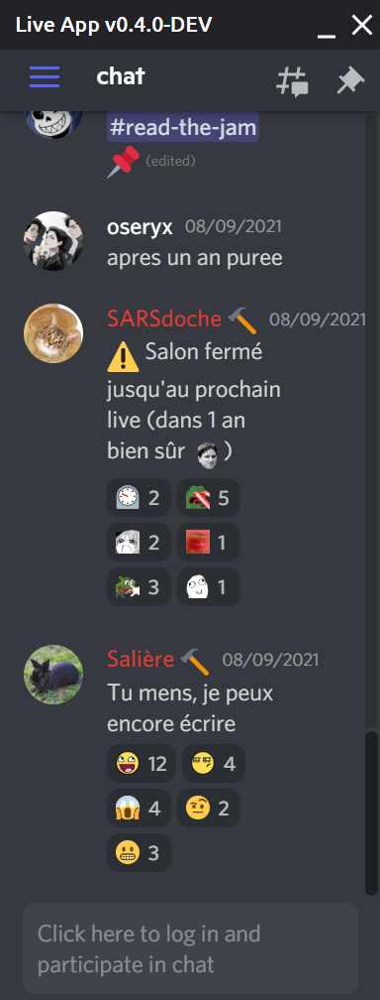

# Live App 🔴

This application allow to read the discord chat of some channel while doing other things, using WidgetBot.
In other words, it is an always on top application, allowing to do some other things like programming in an IntelliJ-based IDE and seeing the chat simultaneously.

**The primary purpose of this app is to be used while streaming live, on discord!**

_This application is a rewrite of the [old and heavy electron app from readthedocs-fr organization](https://github.com/readthedocs-fr/liveapp)._

## How to use

This application uses [WidgetBot](https://widgetbot.io/) to get information from discord.

Follow their instructions on how to use it to configure the app.

You'll need the server id & channel id to configure it.

You can download the latest release from [here](https://github.com/AntoineJT/liveapp/releases).

## How to build

- Install [volta](https://volta.sh/)
- Go to `src/` folder and install dependencies (`npm install`)
- Run command `npm run tauri build`

You will now found the builds into the `dist/` folder.

## License

This application is licensed under the [GPLv3 or later](LICENSE).

## Credits

Thanks to:

- [Shika](https://github.com/shika-blyat) for the original idea and implementation
- [Oseryx](https://github.com/Oseryx) for contributions to the previous app

## Screenshot

Antoine James Tournepiche
